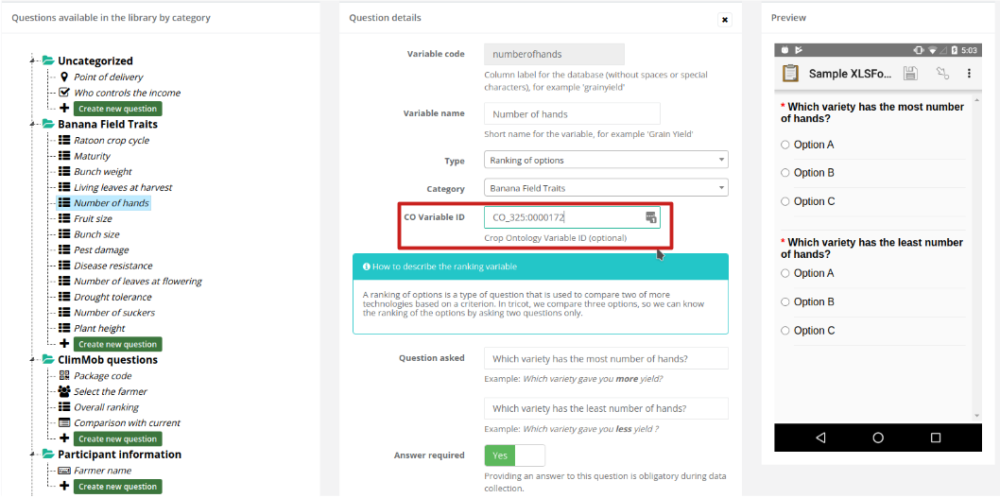
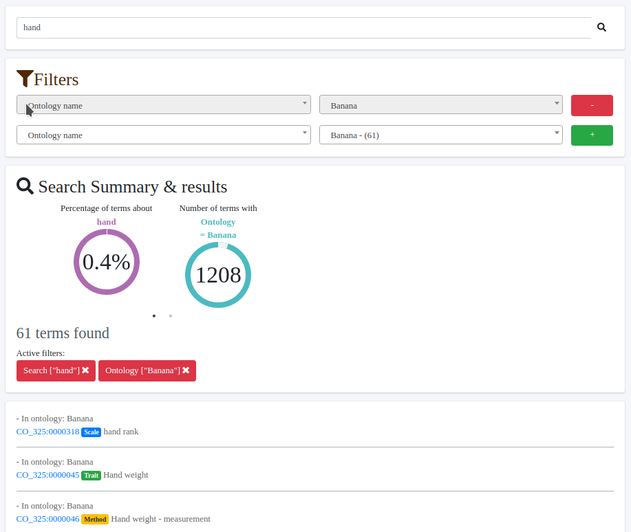
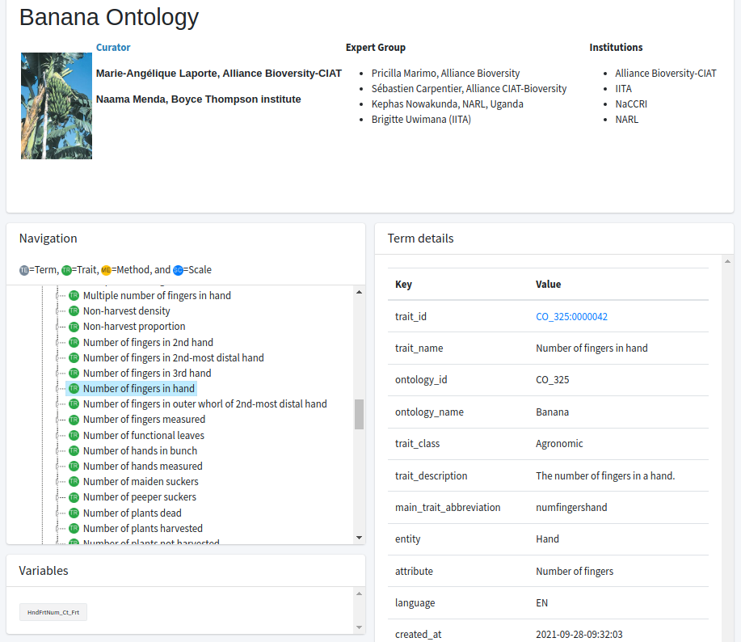

Ontology ClimMob plug-in
==============

This plug-in allows to link [ClimMob](https://github.com/BioversityCostaRica/py3ClimMob) ranking questions with ontological variables in [CropOntology.org](https://cropontology.org/)

Installing the plug-in
---------------

- Download the plugin

```sh
https://github.com/BioversityCostaRica/ontology_plugin.git
```

- Activate the ClimMob environment.

```
$ . ./path/to/ClimmobEnv/bin/activate
```

- Change directory of the CropOntology plugin.
```
$ cd ontology_plugin
```

- Build the plug-in
```
$ python setup.py develop
```

- Add the plug-in to the ClimMob list of plug ins by editing the following line in configuration file (.ini file)
```
    #climmob.plugins = examplePlugin
    climmob.plugins = cropontology
```

- Run ClimMob again

## Features of the plug-in

### Question integration

The plug-in will modify the user interface for creating and editing questions by adding a new field to indicate the ontological variable in CropOntology.org to link with :



### Integration with CropOntology.org

The same field also integrate a search option connected directly to CropOntology. On search a pop-up window will appear to search or explore for ontological terms. On selection of a term will update the field on ClimMob.

|  |  |
| ------------------------ | ------------------------ |

## License

This plug-in is licensed under AGPL-v3
